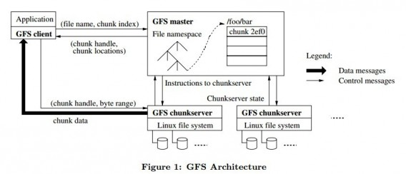

# GFS 阅读笔记

[TOC]
<!-- MarkdownTOC autolink="true" indent="\t" -->

- [分布式系统](#%E5%88%86%E5%B8%83%E5%BC%8F%E7%B3%BB%E7%BB%9F)
- [GFS是什么？](#gfs%E6%98%AF%E4%BB%80%E4%B9%88%EF%BC%9F)
- [GFS 设计背景](#gfs-%E8%AE%BE%E8%AE%A1%E8%83%8C%E6%99%AF)
- [GFS 所需提供操作](#gfs-%E6%89%80%E9%9C%80%E6%8F%90%E4%BE%9B%E6%93%8D%E4%BD%9C)
- [GFS 架构](#gfs-%E6%9E%B6%E6%9E%84)
- [GFS 特点概述](#gfs-%E7%89%B9%E7%82%B9%E6%A6%82%E8%BF%B0)
- [单一 Master 架构](#%E5%8D%95%E4%B8%80-master-%E6%9E%B6%E6%9E%84)
- [chunk 大小](#chunk-%E5%A4%A7%E5%B0%8F)
- [metadata](#metadata)
- [chunk 位置](#chunk-%E4%BD%8D%E7%BD%AE)
- [操作记录（operation log）](#%E6%93%8D%E4%BD%9C%E8%AE%B0%E5%BD%95%EF%BC%88operation-log%EF%BC%89)
- [一致性模型](#%E4%B8%80%E8%87%B4%E6%80%A7%E6%A8%A1%E5%9E%8B)
- [系统间的交互](#%E7%B3%BB%E7%BB%9F%E9%97%B4%E7%9A%84%E4%BA%A4%E4%BA%92)
- [Master 职责](#master-%E8%81%8C%E8%B4%A3)
    - [管理理 namespace](#%E7%AE%A1%E7%90%86%E7%90%86-namespace)
    - [放置 replicas](#%E6%94%BE%E7%BD%AE-replicas)
    - [垃圾回收](#%E5%9E%83%E5%9C%BE%E5%9B%9E%E6%94%B6)
    - [过期 replica 检测](#%E8%BF%87%E6%9C%9F-replica-%E6%A3%80%E6%B5%8B)

<!-- /MarkdownTOC -->

----

### 分布式系统

Some conceptions of distrubted system. 

- **Q1: 一致性是什么？**

在分布式文件系统中，很重要的一部分就是数据的复制（replica）。为了保证分布式系统的高可用性，我们常常会把文件在不同的机器上存储多份，一致性的要求就是保证这些不同机器上的复制品（replica）能够保持一致。

- **Q2: 如果只有一个应用程序，它对文件系统进行了一次写操作，这个应用程序在这次写操作之后的读操作会观测到什么？**

它会正常观测到刚刚写入的数据。

- **Q3: 如果另外多个应用程序执行的读操作呢？它们会观测到什么呢？** 

对于弱一致性的模型来说，这次读操作有可能会读取到已经过期的数据； 

对于强一致性的模型来说，读操作读取到的始终是上一次写入操作进行完成之后的数据； 

强一致性能保证写入操作，但是他会影响性能（强一致性协议很复杂）

- **Q4: 理想化的一致性模型是怎样的**

分布式文件系统通过在多个机器上复制文件来保证可用性，在理想化的一致性模型中，在文件系统中所进行的各种操作都要像是在一台机器上进行的操作。实现理想化一致性模型的难点在于处理高并发问题、如何处理分布式集群中的机器崩溃以及达到网络的高效利用，理想化的一致性模型还会出现裂脑问题（split-brain，如果两个存储着相同文件的机器 A，B同时崩溃，其他的机器并不知道是哪一个先崩溃的，所以就不知道该用 A 恢复 B还是用 B 恢复 A）。总之，使用理想化一致性算法会影响性能，并且它的实现非常复杂（例如：Paxos）

GFS 不是采用的理想化一致性模型，但是它解决了机器崩溃恢复的问题以及能够应对高并发操作同时又能相对高效地利用网络。

----

### GFS是什么？ 

GFS（Google File System ）是一个大规模分布式文件系统，具有容错的特性（机器崩溃后的处理），并且具有较高性能，能够响应众多的客户端。

----

### GFS 设计背景
- 经常会有机器崩溃（因为机器众多，难免会有机器崩溃）
- 有些存储的文件比较大
- append 操作更常见（在文件后追加，而不是 overwrite 覆盖）
- 主要包括两种读取 （read）操作：一种是大的顺序读取（单个文件读取几百 KB 甚至是几 MB）；另一种是小的随机读取（在随机位置读取几 KB）
- 需要支持并发（例如，多个客户端同时进行 append 操作）

----

### GFS 所需提供操作

create（文件创建）、delete（文件删除）、open（打开文件）、close（关闭文件）、read（读取文件）、write（写入文件）、record append（追加文件）、snapshot（快照）。

----

### GFS 架构

GFS 的架构由一台 master 服务器和许多台文件服务器（chunkserver）构成，并且有若干客户端（client）与之交互。

一份文件被分为多个固定大小的chunk（默认64M），每个chunk有全局唯一的文件句柄 －－ 一个64位的chunk ID，每一份chunk会被复制到多个chunkserver（默认值是3)，以此保证可用性与可靠性。chunkserver将chunk当做普通的Linux文件存储在本地磁盘上。

　　GFS master是系统的元数据服务器，维护的元数据包括：命令空间（GFS按层级目录管理文件）、文件到chunk的映射，chunk的位置。其中，前两者是会持久化的，而chunk的位置信息来自于Chunkserver的汇报。

　　GFS master还负责分布式系统的集中调度：chunk lease管理，垃圾回收，chunk迁移等重要的系统控制。master与chunkserver保持常规的心跳，以确定chunkserver的状态。
　　GFS client是给应用使用的API，这些API接口与POSIX API类似。GFS Client会缓存从GFS master读取的chunk信息（即元数据），尽量减少与GFS master的交互。

----

### GFS 特点概述

- 文件分块（chunks），每块有一个64位标识符（chunk handle），它是在 chunk 被创建时由 master 分配的，每一个 chunk 会有3个备份，分别在不同的机器上。
- Master 存储所有的 metadata，包括命名空间（namespace）、访问控制信息（access control）、文件与 chunk 的映射关系（mapping）以及 chunk 的存储位置
- Master 管理 chunk 租约（lease）、chunk 迁移（如果 chunkserver 挂掉）、chunkserver 之间的通信（heartbeat，它也会向 chunkserver传达master 的命令，chunkserver 通过 heartbeat 向 master 报告自己的状态）
- Client 会和 master 以及 chunkserver 进行交互，client向 master 请求 metadata，然后向 chunkserver 进行读写操作
- client 与 chunkserver 都不会缓存文件数据，为的是防止数据出现不一致的状况。但是 client 会缓存 metadata 的信息（但是会出现一个问题，如果 metadata 过期怎么办呢？GFS 给出了自己的解决方案，也就是租约 lease）

----

### 单一 Master 架构

GFS 为了简化设计，在整个系统中只有一个 master 进行管理。Master 不提供读写操作，它只会告诉 client，它所请求操作的文件在哪个 chunkserver 上，然后 client 会根据 master 提供的信息，与对应的 chunkserver 进行通信。

例如：以 client 要进行读取操作为例

client 将应用程序请求的文件名、大小转化为 chunk index，然后将文件名和 index 发送给 master
master 返回文件的 chunk handle 和所有该文件备份的位置
client 将这两个 master 发送给它的信息缓存起来作为 value，文件名和 chunk index 作为 key
client 向三个备份之一的 chunkserver 发送读请求（选择最近的机器），请求中包含 chunk index 和它要读取的文件的 Byte 范围
如果 client 缓存的信息没有过期（如何知道是否过期会在后面的文章进行介绍），client 就不用在与 master 进行通信了，以后可以直接与 chunkserver 进行通信

----

### chunk 大小

GFS 中将 chunk 的大小定为 64MB，它比一般的文件系统的块大小要大。

这样做的优点有：

- 减少 client 与 master 的交互
- client 可以在一个块上执行更多的操作，通过 TCP 长连接减少网络压力
- 减小 metadata 的大小

但是这样做也存在缺点：

- 一个 chunk 可以存更多的小文件了，这样的话如果有一个块存储了许多小文件，client 和它进行操作的几率大大提高，这个 chunk 的压力会很大（然而在实际中，这个问题影响并不大）
- 在批处理系统中存在很大问题（如果在一个 chunk 上有一个可执行文件，同时有许多 client 都要请求执行这个文件，它的压力会很大。解决方案是把该文件在不同的 chunkserver 上多添加几个备份，更长久的方案是应该允许 client 去读取其他 client 的文件）

----

### metadata

GFS 的 metadata 存储着 3 种类型的信息：

- 文件名以及 chunk 的名称
- 文件与 chunk 的映射关系
- 各个备份（replicas）的位置
Metadata 通常存储于内存中，前两种信息有时会存于磁盘中，它们有时会作为操作记录（operation log）备份的一部分存储于磁盘，备份于远程机器。

把 metadata 存储于内存有许多优点，查看 metadata 信息时很方便，速度快，有利于 chunk 的垃圾回收（garbage collection）、再备份（re-replication）以及 chunk 迁移（为的是负载均衡）。

但是如果如果Metadata都存放于内存的话会不会受限于内存的大小呢？

实际上不会的，因为每一条 metadata 的大小非常小，namespace 信息也很小，并且使用了前缀压缩（prefix compression）进行存储。并且升级内存的花费实际上也很小。

----

### chunk 位置

chunk 的位置信息在 master 中不是一成不变的，master 会通过定期的 heartbeat 进行更新，这样做能够减小开销，这样做就不用 master 与 chunkserver 时刻保持同步通信（包括 chunkserver 的加入、退出、改名、宕机、重启等）。chunkserver 上有一个 final word，它表示了哪个 chunk 在它的磁盘上，哪个 chunk 不在。

----

### 操作记录（operation log）

operation log 中包括了 metadata 变更的历史记录

- 它是 metadata 的持久化记录，备份于磁盘上
- 它表示了并发操作的时间线
- 用于 Master 恢复

----

### 一致性模型

GFS 采用的一致性模型并不是强一致性模型，这是在考虑了各种问题后权衡的结果。

** GFS 是如何保证一致性的？**

有关文件命名空间的操作都是原子的（由 namespace lock 保证）

我们先来介绍一下 GFS 保证一致性的前提和一些概念：

- **如果所有客户端不论从哪一个备份中读取同一个文件，得到的结果都是相同的，那么我们就说这个文件空间是一致的（consistent）**
- defined：如果一个文件区域在经过一系列操作之后依旧是一致的，并且客户端完全知晓对它所做的所有操作，我们就称它为『defined』
- 一个操作如果没有被其他并发的写操作影响，那么这个被操作的文件区域是 defined 的
- 成功的并发操作也会导致文件区域 undefined，但是一定是一致的（consistent）（客户端有可能只看到了最终一致的结果，但是它并不知道过程）
- 失败的并发操作会导致文件区域 undefined，所以一定也是不一致的（inconsistent）
- GFS 并不需要是因为什么导致的 undefined（不区分是哪种 undefined），它只需要知道这个区域是 undefined 还是 defined 就可以

造成数据改变的操作可能是写入（write）或者追加（record append）：

- write：往应用程序指定的 offset 进行写入
- record append：往并发操作进行过的 offset 处进行写入，这个 offset 是由 GFS 决定的（至于如何决定的后面会有介绍），这个 offset 会作为 defined 区域的起始位置发送给 client。
- “regular” append：对应于 record append 的一个概念，普通的 append 操作通常 offset 指的是文件的末尾，但是在分布式的环境中，offset 就没有这么简单了

**重要问题**

- GFS 通过在所有的备份（replicas）上应用顺序相同的操作来保证一个文件区域的 defined（具体细节后面会讨论）
- GFS 会使用 chunk version（版本号）来检测 replicas 是否过期，过期的 replicas 既不会被读取也不会被写入
- GFS 通过握手（handshakes）来检测已经宕机的 chunkserver
-GFS 会通过校验和（checksuming）来检测文件的完整性

----

###系统间的交互

讨论系统中各个部分之间的交互（master 和 chunkserver、client 和 master、chunkserver 等），GFS 设计的目标是尽可能地让 master 更少的涉及到各种操作中。

**租约（lease）和修改的顺序（mutation order）**

Mutation（修改）：mutation 指的是改变了 chunk 的内容或者 metadata，每一次 mutation 都应该作用于所有的备份

GFS 使用租约机制（lease）来保障 mutation 的一致性：**多个备份中的一个持有 lease，这个备份被称为 primary replica（其余的备份为 secondary replicas），GFS 会把所有的 mutation 都序列化（串行化），让 primary 执行，secondary 也按相同顺序执行，primary 是由 master 选出来的。一个 lease 通常60秒会超时。** 

现在我们以写操作的数据流程来说明租约机制是如何进行的：

- client 向 master 请求持有 lease 的 chunk（primary replica）位置和其他 replicas 的位置（如果没有 chunk 持有 lease，那么 master 会授予其中一个 replica 一个 lease）
- master 返回 primary 的信息和其他 replicas 的位置，然后 client 将这些信息缓存起来（只有当 primary 无法通信或者该 primary replica 没有 lease 了，client 才会向 master 再次请求）
- client 会将数据发送到所有的 replicas，每个 chunkserver 会把数据存在 LRU 缓存中
- 在所有的 replicas 都收到了数据之后，client 会向 primary 发送写请求。primary 会给它所收到的所有 mutation 分配序列号（这些 mutation 有可能不是来自于同一个 client），它会在自己的机器上按序列号进行操作
- primary 给 secondaries 发送写请求，secondaries 会按相同的序列执行操作
- secondaries 告知 primary 操作执行完毕
- primary 向 client 应答，期间的错误也会发送给 client，client 错误处理程序（error handler）会重试失败的 mutation

其他问题：

- 如果一次写操作要写的数据比较大，可能会跨越多个 chunk，GFS client 会把它分为几次小的操作，GFS 支持的最大的操作大小是 chunk 的1/4的大小
- 但是如果像上述这么做会出现 undefined 但是 consistent 的区域，这是为什么呢？GFS 的 record append 操作仅能保证数据在一个原子单位中被写了一次，并不能保证对所有的 replicas 操作的位置都是相同的，比如每次写入的 offset 相同，但是 chunk 有可能不一样

----

### Master 职责

- 执行所有有关于 namespace 的操作
- 管理整个系统的 chunk replicas：
	- 做出 chunk replicas 的放置决定
	- 创建 chunk/replicas
	- 协调各种操作，保证 chunk 被完全复制
	- 负载均衡
	- 回收闲置空间

#### 管理理 namespace

在进行快照操作时，lease 会被废除，无法进行写操作，但是 GFS 希望其他 Master 操作不受影响，GFS 采取的方法是使用namespace 锁。

GFS 的namespace 是一个查找表（lookup table），并且采用了前缀压缩的方式存储在内存中，它是一个树结构，namespace 树中的每一个节点（文件名或者目录名）都有一个读/写锁。

在 Master 对文件或者目录进行操作之前它首先需要获取一个锁，比如要对 /d1/d2/…/dn/leaf 进行操作，需要获得 /d1, /d1/d2, /d1/d2/…/dn的读锁，需要 /d1/d2/…/dn/leaf 的读锁或者写锁（根据不同的操作，锁也不同）

例如，当/home/user 被快照备份至/save/user 时，如果此时要创建/home/user/foo 会发生什么呢？

快照操作获得了/home, /save 的读锁和/home/user, /save/user 的写锁。创建/home/user/foo需要/home, /home/user的读锁和/home/user/foo 的写锁。因为两个操作在 /home/user的锁上产生了冲突，所以操作会依次执行，在完成 snapshot 操作之后，释放了/home/user 的写锁， /home/user/foo才会被创建。

#### 放置 replicas

如何安置replicas 的目标是：

- 最大化数据可靠性和可用性
- 最大化网络带宽的利用
- 
这里的最大化不仅仅是机器间的问题，还要考虑机架间的问题

在以下3种情况下，Master 会进行创建 replicas 的操作：

- 创建了新的 chunk
- 需要重新备份
- 负载均衡
- 
如何选择将 replicas放置到哪台机器上呢？

1. 优先选择磁盘利用率低的 chunkserver
2. GFS 会限制每个 chunkserver『最近』创建的次数。换句话说，如果一个 chunkserver 近期创建 replicas 的操作比较频繁，就不会优先选择它（因为创建就意味着以后会进行读取，为了防止突然间大量的读取出现在同一台机器上）
3. 保证可用性，尽可能跨机架进行创建操作

当可用的备份低于要求时（GFS 要求为3份），master 会对 chunk 进行重新备份，在以下情况有可能需要重新备份：

- chunkserver 不可用了
- 备份损坏了
- 硬盘挂掉了
- 所要求的最低备份数量提高了

当有多个 chunk 需要备份时，GFS 如何决定先备份哪个呢？策略如下：

- 优先选择可用备份少的
- 优先备份最近没有 delete 文件的
- 优先备份阻塞了 client 操作的

当 master 决定了备份哪个之后，会把当前可用的 chunk 直接克隆到目标位置（遵循replicas 放置规则）

#### 垃圾回收

文件 delete 之后，GFS 并不会立即对空间进行回收，而是等待垃圾回收机制会空间进行释放。

当文件被删除之后，Master 会想其他操作一样，把删除操作记录下来，但是不进行空间的回收，而是将这块空间命名为 hidden（并且包含被删除时的时间戳），Master 会定期进行扫描，把隐藏了一定时间的文件空间进行回收（这个时间是可以进行配置的），在此期间可以对这块空间的文件进行恢复（直接通过重命名回原来的名称就可以）。

除此之外，垃圾回收机制还会扫描孤儿 chunk（所有的文件都没有用到的非空 chunk），然后对这块 chunk 的 metadata 进行清除。具体的做法是，在 master 于 chunkserver 的 heartbeat 信息中会携带关于 chunk 的信息，master 会把 metadata 中不存在的 chunk 发送给 chunkserver，chunkserver 会把它拥有的 chunk 发送给 master。

#### 过期 replica 检测

chunkserver 宕机或者是 mutation 的丢失会导致 replica 的过期，GFS 是如何对 replicas 进行检测，判断它们是否是最新的呢？

GFS 对于每一个 chunk 都会有一个版本号，这个版本号由 master 进行管理，通过版本号可以对过期的 replica 进行甄别。当 master 授予 lease 的时候，会增加版本号并且通知所有未过期的 replicas，master 和 replicas 都会记录下最新的版本号（这些操作需要在客户端进行写入操作之前完成）。如果这时，有一个 replica 不可用了，它的版本号就不会再增加了，在 chunkserver 重启或者重新向 master报告它的版本号时，master 就会知道这个 replica 已经过期了，并且会在垃圾回收时将它进行回收。如果 master 的版本号落后了呢，它会更新自己的版本号。
