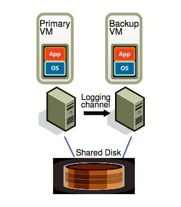
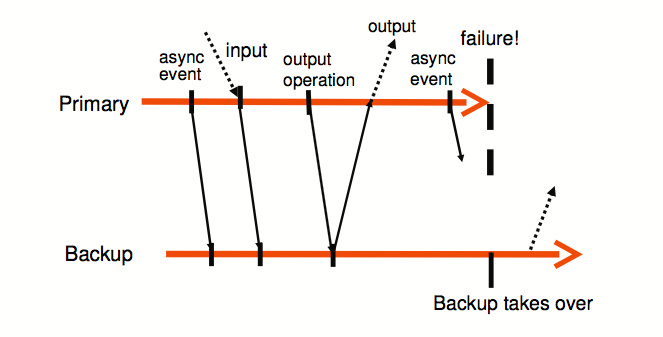
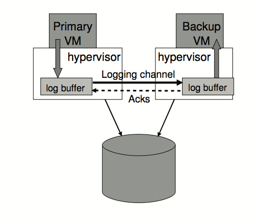

# 容错虚拟机分布式系统的设计

<!-- MarkdownTOC indent="\t" autolink="true" -->

- [基本设计方案](#%E5%9F%BA%E6%9C%AC%E8%AE%BE%E8%AE%A1%E6%96%B9%E6%A1%88)
- [确定（deterministic）操作的演绎](#%E7%A1%AE%E5%AE%9A%EF%BC%88deterministic%EF%BC%89%E6%93%8D%E4%BD%9C%E7%9A%84%E6%BC%94%E7%BB%8E)
- [FT（Fault-Tolerance）协议](#ft%EF%BC%88fault-tolerance%EF%BC%89%E5%8D%8F%E8%AE%AE)
- [宕机检测](#%E5%AE%95%E6%9C%BA%E6%A3%80%E6%B5%8B)
- [具体实现](#%E5%85%B7%E4%BD%93%E5%AE%9E%E7%8E%B0)
	- [启动/重启 Virtual Machine](#%E5%90%AF%E5%8A%A8%E9%87%8D%E5%90%AF-virtual-machine)
	- [管理 Logging Channel](#%E7%AE%A1%E7%90%86-logging-channel)
	- [Disk I/O问题](#disk-io%E9%97%AE%E9%A2%98)
- [Summary](#summary)

<!-- /MarkdownTOC -->

----

在分布式系统中，容错方法有很多种，常见的传统方法有： 

- **主/副服务器方法**（当主服务器宕机之后，由副服务器来接管它的工作），这种方法通常需要机器之间的的高带宽。
- **确定状态自动机方法** ，将另一台服务器初始化为和主服务器一样的状态，然后让它们都接受到同样的输入，这样它们的状态始终保持一致，但是这种方法对于非确定的（non-deterministic）操作并不适用。 

本文中讨论的方法是使用虚拟机作为状态机，它具有以下优点：

+ 操作全部被虚拟化
+ 虚拟化本身就支持 non-deterministic 操作
+ 虚拟机管理程序（Hypervision）能够记录所有在虚拟机上的操作，所以能够记录主服务器（Primary）所有的操作，然后在服务器（Backup）上进行演绎. 

### 基本设计方案

如上图就是本文提到的容错系统的架构，一个Primary，一个Backup，Primary 和 Backup 之间通过 Logging Channel 进行通信， Primary 和 Backup 基本保持同步，Backup 稍稍落后，它们两个之间会通过 heartbeat 进行 fail 检测，并且它们使用共享磁盘(Shared Disk)。

### 确定（deterministic）操作的演绎

让两台机器初始状态相同，它们接受相同的输入，顺序相同，两台机器执行的任务的结果就会相同。但是如果存在非确定的（non-deterministic）操作（比如中断事件、读取CPU时钟计数器的值操作就是非确定的），它会影响状态机的执行。
难点在于：

- 需要捕捉全部的输入和 non-deterministic 操作在保证 Backup 是deterministic 的
- 需要准确将全部输入和 non-deterministic 操作应用到 Backup 中
需要保证系统高效

设计方案为：将所有的 input 和 non-deterministic 操作写入到 log 中（file），对于 non-deterministic 操作还要记录和它相关的状态信息等，确保 non-deterministic 操作后Backup状态还是和 Primary 一致。 

### FT（Fault-Tolerance）协议

FT协议是应用于 Logging Channel 的协议，协议的基本要求为：

如果 Primary 宕机了，Backup 接替它的工作，Backup 之后向外界发出所有的Output 要和 Primary 原本应当发送的一致。

为了保证上述的要求，设计如下的系统

+ Primary 会在所有关于本次 Output 的所有信息都发送给 Backup 之后（并且要确保 Backup 收到）才会把 output 发送给外界
+ Primary 只是推迟将 output 发送给外界，而不是暂停执行后边的任务

流程图如图所示：

但是这种方法不能保证 output 只发出一次，如果 primary 宕机了，backup 不能判断它是在发送了 output 之前还是之后宕机的，因此 backup 会再发送一次 output。但是这个问题很容易解决，因为：

+ output 是通过网络进行发送的，例如 TCP 之类的网络协议能够检测重复的数据包
+ 即使 output 被发送了2次其实也没关系。如果 output 是一个写操作，它会在同一个位置写入两次，结果不会发生变化；如果 output 是读取操作，读的内容会被放入 bounce buffer（为了消除 DMA 竞争），数据会在 IO 中断之后被送到。

### 宕机检测

如何知道有机器宕机，在该系统中是十分重要的。该设计使用的是UDP heartbeat 机制来检测 Primary 与 Backup 之间的通信是否正常。

但是使用这种方法会存在裂脑问题（split-brain，Primary 和 Backup 同时宕机），该怎么解决呢？

该设计中使用了共享存储（Shared Storage），对它的操作是原子的，Primary 和 Backup不能同时进行一个操作（提供原子的 test-and-set 操作）

如果检测出 Primary 宕机，Backup 会成为 Primary，接替之前的工作，然后再寻找一个 Backup。

### 具体实现

#### 启动/重启 Virtual Machine

如何启动一个和 Primary 状态一样的 Backup？

VMware Vmotion 操作能够将一台 VM 从一个 Server 完整的迁移到另一个 Server（只需要很短的中断），在该设计中的方法对 Vmotion 做了一点修改，不是进行迁移，而是直接克隆。

#### 管理 Logging Channel

如图，该设计使用了一个大的 buffer，来保存 logging entries，Primary 把自己的 entry 存到 buffer 中，由 logging channel 发送给Backup 的 buffer，然后 Backup 从 buffer 读取命令执行。

+ 如果 Backup 的 buffer 空了，没有命令执行了，Backup 会等待新的 entry。
+ 如果 Primary 的 buffer 满了，Primary 会等待，等 buffer 中有空余空间再继续执行。

#### Disk I/O问题

1. disk 操作是并行的，同时对 disk 的同一位置进行操作会导致 non-deterministic
	- 解决方案：检测 IO 竞争，使这些操作串行执行

2. Disk IO 使用 DMA（Direct Memory Access），同时访问内存同一位置的操作会导致 non-deterministic

	- 解决方案：对 disk 操作的内存设置内存的页保护，但是这种方法代价太高；该设计中使用了 bounce buffer，它的大小和 disk 所操作的内存部分大小是一致的，read 操作直接将内容读入 buffer，当其他操作完成，写入内存，write 操作将写内容写入 buffer，之后再写入磁盘。

----

### Summary

Vmware 提出的这种 Primary/Backup 方法是分布式容错方法中非常重要的一部分，可以用在许多系统中，不仅仅是分布式存储（GFS 的容错方法），也可以用在分布式计算中，因为它是将所有的操作都记录下来，将它们重新在 Backup 上进行演绎，从而起到了备份的作用，能够做到容错（Fault-Tolerance）。

----
